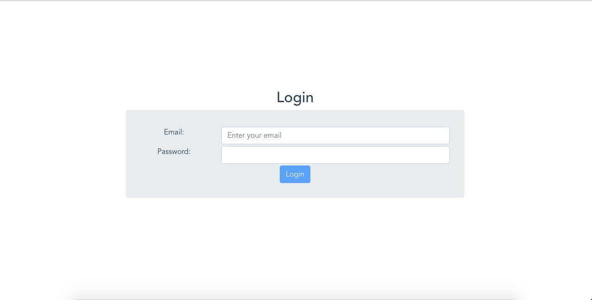

# firebase-chat


<br>


Collaboration Vue + Firebase

## Project setup
```
npm install
```

### Compiles and hot-reloads for development
```
npm run serve
```

### Compiles and minifies for production
```
npm run build
```

### Run your unit tests
```
npm run test:unit
```

### Lints and fixes files
```
npm run lint
```

### Customize configuration
See [Configuration Reference](https://cli.vuejs.org/config/).


### LOGIN Jarjit Singh
```
email : jarjit@mail.com
password: 123456
```

### LOGIN Ismail
```
email : ismail@mail.com
password: 123456
```

